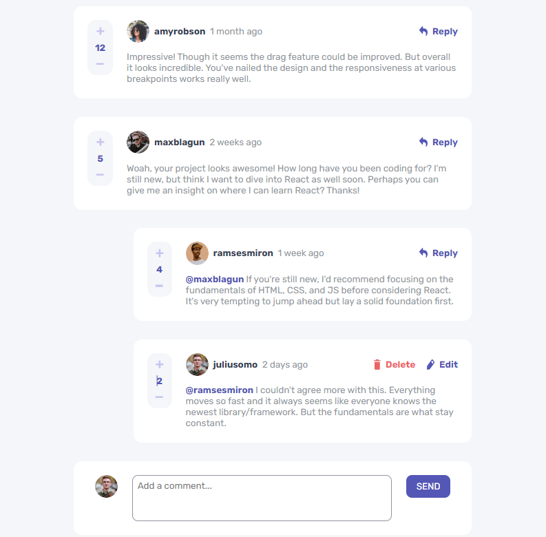

# Frontend Mentor - Interactive comments section solution

This is a solution to the [Interactive comments section challenge on Frontend Mentor](https://www.frontendmentor.io/challenges/interactive-comments-section-iG1RugEG9). Frontend Mentor challenges help you improve your coding skills by building realistic projects. 

## Table of contents

- [Overview](#overview)
  - [The challenge](#the-challenge)
  - [Screenshot](#screenshot)
  - [Links](#links)
- [My process](#my-process)
  - [Built with](#built-with)
  - [What I learned](#what-i-learned)
  - [Useful resources](#useful-resources)
- [Author](#author)
- [Acknowledgments](#acknowledgments)

## Overview

### The challenge

Users should be able to:

- View the optimal layout for the app depending on their device's screen size
- See hover states for all interactive elements on the page
- Create, Read, Update, and Delete comments and replies
- Upvote and downvote comments
- **Bonus**: If you're building a purely front-end project, use `localStorage` to save the current state in the browser that persists when the browser is refreshed.
- **Bonus**: Instead of using the `createdAt` strings from the `data.json` file, try using timestamps and dynamically track the time since the comment or reply was posted.

### Screenshot



### Links

- Solution URL: [Interactive comments section](https://github.com/danielaser/Interactive-comments-section)
- Live Site URL: [Interactive comments section website](https://interactive-comments-replies-section.netlify.app/)

## My process

### Built with

- Semantic HTML5 markup
- CSS custom properties
- Flexbox
- Vanilla Javascript
- [Styled Components](https://styled-components.com/) - For styles

### What I learned

I am learning a lot about cicles and conditions in this challenge. Also to implement style that helps in somo of the functionalities.

```css
.disable-edit {
    pointer-events: none;
}
```
```js
for (let i = 0; i < myJSONData.comments.length; i++) {
            for (let j = 0; j < myJSONData.comments[i].replies.length; j++) {
                if (myJSONData.comments[i].replies[j].id > maxId) {
                    maxId = myJSONData.comments[i].replies[j].id;
                }
            }
        }
```

### Useful resources

- [Example resource 1](https://www.w3schools.com/) - This website helped me to know Javascript functionalities. I really liked this page because I can implement functions that I did not know before and they make my work easier.

## Author

- Website - [Daniela Serrano](https://danielaser.github.io/)
- Frontend Mentor - [@danielaser](https://www.frontendmentor.io/profile/danielaser)
- GitHub - [@danielaser](https://github.com/danielaser)

## Acknowledgments

Thanks to this challenge I improved my knowledge about Json files conections. I implemented CRUD: create, read, edit and delete elements from the Json file. I did everything with Vanilla Javascript.
